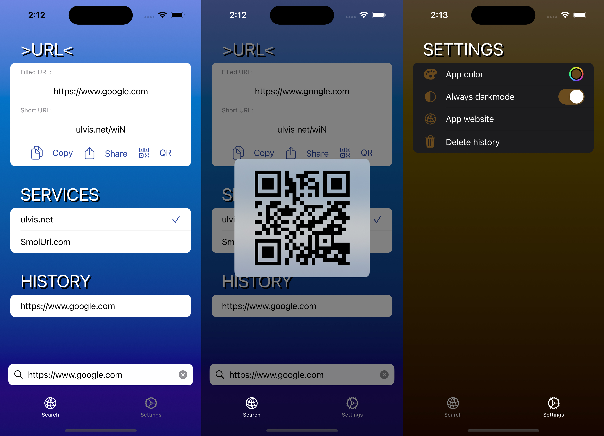

# URL Shortener App

This is a SwiftUI application designed to shorten URLs. 
It utilizes native async/await for asynchronous operations, SwiftData for data persistence, and follows the MVVM (Model-View-ViewModel) architecture pattern. The code emphasizes modularity, using protocols extensively, and employs dependency injection managed through the "Factory" library.

## Preview

## Features

- **URL Shortening:** Easily shorten long URLs to make them more manageable and shareable.
- **Async/Await:** Utilizes the native async/await syntax for handling asynchronous operations, ensuring a more straightforward and readable codebase.
- **MVVM Architecture:** Organized according to the MVVM pattern, separating concerns and promoting a more maintainable and testable code structure.
- **Modular Design:** Emphasizes modularization to improve code reusability, scalability, and maintainability.
- **Dependency Injection:** Manages dependencies using the "Factory" library, facilitating easier testing, decoupling of components, and better overall code organization.
- **SwiftData Persistence:** Utilizes SwiftData for data persistence, ensuring efficient storage and retrieval of shortened URLs.

## Acknowledgements
- Special thanks to the authores of used API Services.
